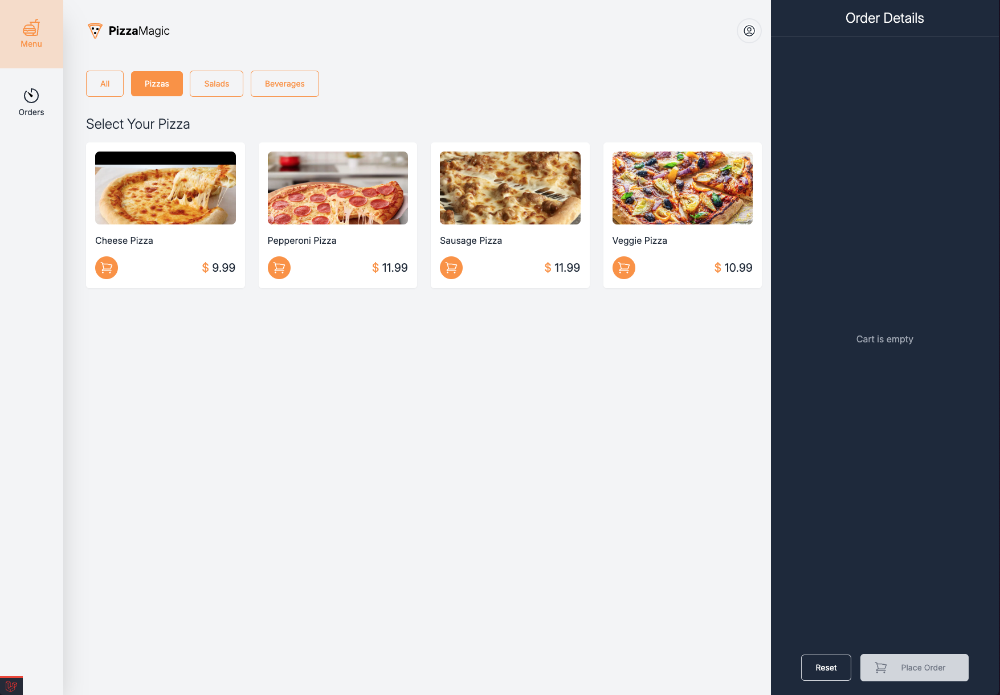
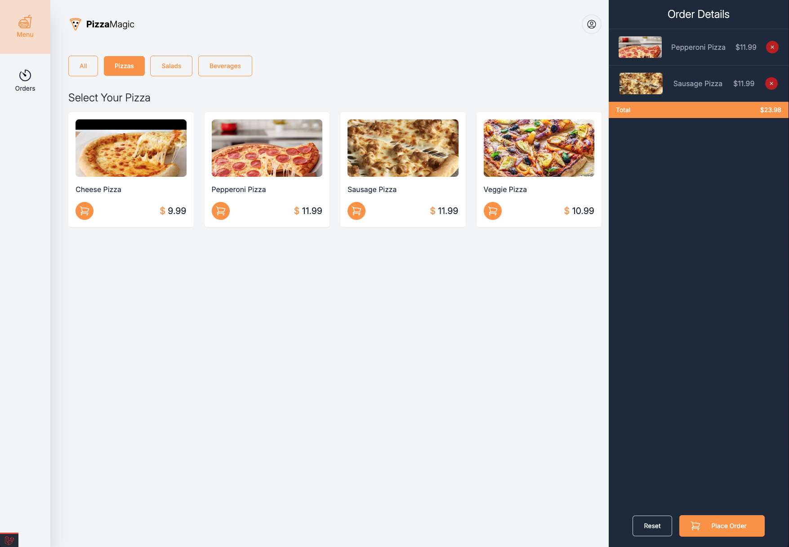
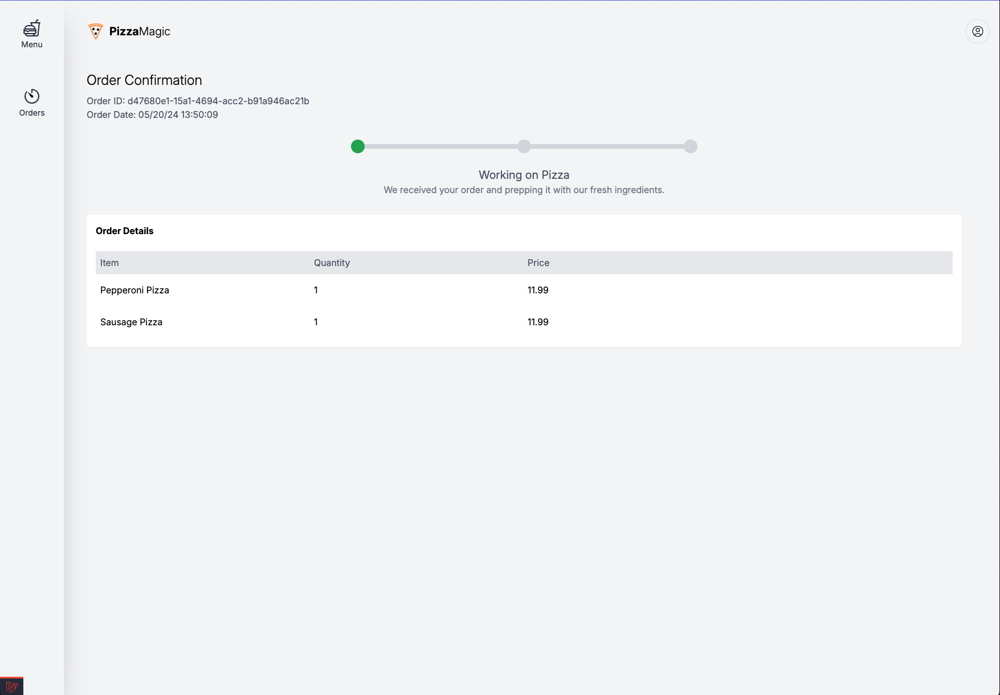
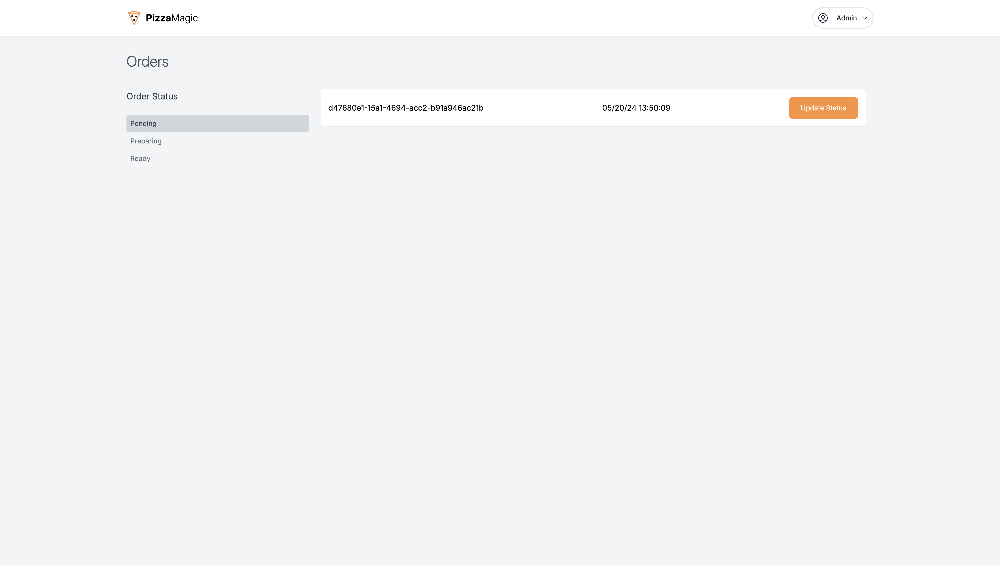
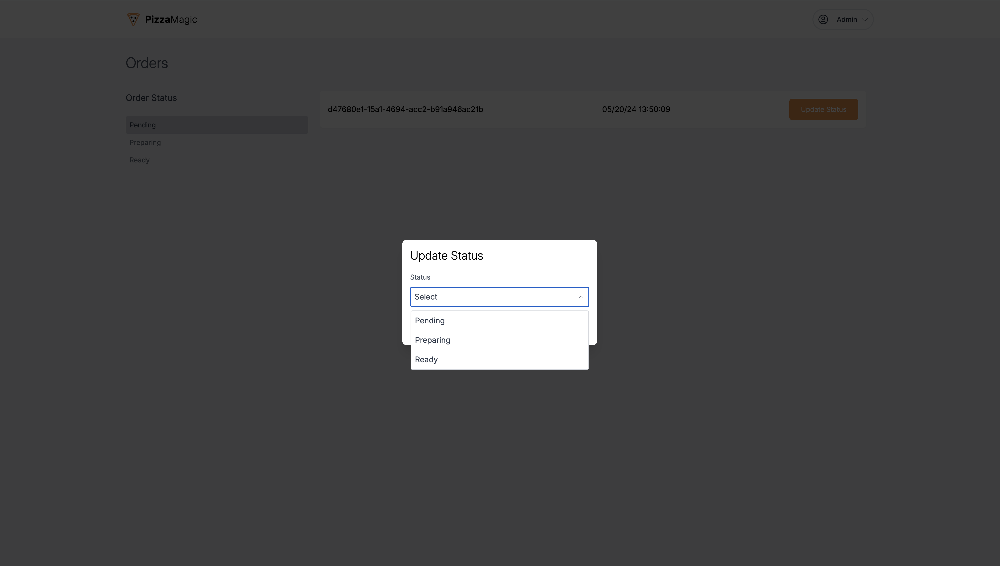
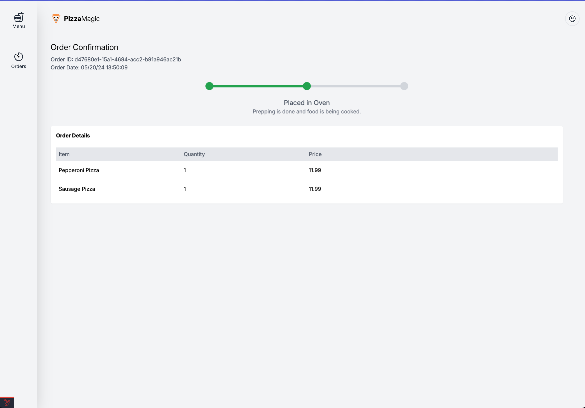
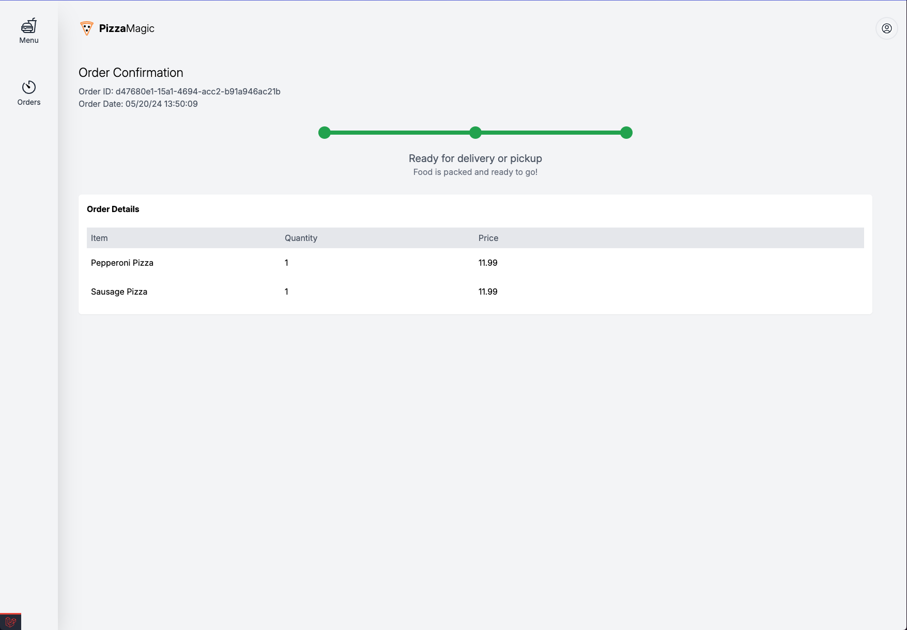

## PizzaMagic

This is a tall stack application running on Sail. I had to use Pusher because I couldn't get Reverb to work properly.

### Setup

Create an `.env` file, copy the contents of `.env.example` and paste it in `.env`. Enter all the necessary credentials like for database, Pusher, etc.

Run the following

```shell
sail up
sail composer install
pnpm i
sail artisan migrate --seed
```

### Using the App

The seeds will create two users; an `admin@pizzamagic.com` and a `one@customer.com`. Both users can login at `http://localhost/login` and both users passwords are `password`. 

To see changes done in realtime, you should log in as both users in separate browsers and make changes.

You can create an order with the customer account by clicking on the orange buttons for each pizza. Once order is created, the user would be redirected to the confirmation page. The admin can make updates to the order by clicking `Update Status`, choosing the status and save.

## Screenshots








